# Daily Organization Report

Generate a comprehensive daily activity report for a GitHub organization. The report covers
all repositories with activity in the specified time window, including commits, pull requests,
branches, issue changes, and force-push tracking.

## Inputs

The following environment variables or prompt context control behavior:

| Variable               | Default                  | Description                                                            |
| ---------------------- | ------------------------ | ---------------------------------------------------------------------- |
| `REPORT_TIME_SCOPE`    | `1 day`                  | Free-form time scope, e.g. "1 day", "3 days", "1 week"                 |
| `REPORT_SUBJECT_SCOPE` | `nsheaps`                | Free-form subject scope, e.g. org name, specific repo, or email filter |
| `REPORT_DATE`          | Yesterday (Eastern Time) | The date the report covers, format YYYY-MM-DD                          |

## Data Gathering

Use `gh` CLI with the available `GH_TOKEN` for all GitHub API calls. The token must have
org-level read access to repositories, issues, and pull requests.

### Step 1: Identify Active Repositories

```bash
# List all repos in the org
gh repo list "${ORG}" --limit 500 --json nameWithOwner,pushedAt -q '.[] | select(.pushedAt >= "'${SINCE_DATE}'") | .nameWithOwner'
```

If the subject scope names a specific repository, only report on that repo.
If the subject scope includes an email filter, gather from all repos but filter commits by that author email.

### Step 2: Gather Commits Per Repository

For each active repository, gather commits across ALL branches:

```bash
# All commits in the time window across all branches
gh api "repos/${OWNER}/${REPO}/commits" \
  --paginate \
  -q '.[] | {sha: .sha, message: .commit.message, author: .commit.author.name, email: .commit.author.email, date: .commit.author.date, branch: "N/A"}' \
  -f since="${SINCE_ISO}" -f until="${UNTIL_ISO}"
```

For more granular per-branch data, also list branches and check commits per branch:

```bash
# List all branches
gh api "repos/${OWNER}/${REPO}/branches" --paginate -q '.[].name'

# Commits on a specific branch
gh api "repos/${OWNER}/${REPO}/commits?sha=${BRANCH}&since=${SINCE_ISO}&until=${UNTIL_ISO}" --paginate
```

### Step 3: Detect Force Pushes and Trace Previous Commit Trees

Force pushes rewrite history. To detect them, check the audit log and reflog events:

```bash
# Check for push events that were force pushes (org audit log)
gh api "/orgs/${ORG}/audit-log" \
  -f phrase="action:git.push created:>=${SINCE_DATE}" \
  -f include=git \
  --paginate \
  -q '.[] | select(.force_push == true) | {repo: .repo, actor: .actor, before: .before, after: .after, timestamp: .created_at}'
```

If the audit log is not available (requires GitHub Enterprise or org admin), use the events API as a fallback:

```bash
# Push events for a repo (includes force push info)
gh api "repos/${OWNER}/${REPO}/events" \
  --paginate \
  -q '.[] | select(.type == "PushEvent") | {ref: .payload.ref, size: .payload.size, before: .payload.before, head: .payload.head, forced: .payload.forced, actor: .actor.login, created_at: .created_at}'
```

When a force push is detected:

1. Record the `before` SHA (the previous HEAD)
2. Record the `after` SHA (the new HEAD)
3. Use `gh api repos/${OWNER}/${REPO}/compare/${BEFORE}...${AFTER}` to show what changed
4. Try to list the commits that were on the old tree: `gh api repos/${OWNER}/${REPO}/commits?sha=${BEFORE}` (these may be garbage-collected)
5. Include both the old and new commit trees in the report under a "Force Push History" subsection

### Step 4: Gather Pull Requests

```bash
# PRs updated in the time window (all states)
gh pr list -R "${OWNER}/${REPO}" \
  --state all \
  --json number,title,state,author,createdAt,updatedAt,mergedAt,url,headRefName,baseRefName,additions,deletions \
  -L 500
```

Filter results to PRs with `updatedAt` within the time window.

### Step 5: Gather Branch Activity

```bash
# All branches with their last commit info
gh api "repos/${OWNER}/${REPO}/branches" --paginate \
  -q '.[] | {name: .name, sha: .commit.sha, protected: .protected}'

# Recently created or deleted branches (from events)
gh api "repos/${OWNER}/${REPO}/events" \
  --paginate \
  -q '.[] | select(.type == "CreateEvent" or .type == "DeleteEvent") | select(.created_at >= "'${SINCE_ISO}'") | {type: .type, ref: .payload.ref, ref_type: .payload.ref_type, actor: .actor.login}'
```

### Step 6: Gather Issue Changes

```bash
# Issues updated in the time window
gh issue list -R "${OWNER}/${REPO}" \
  --state all \
  --json number,title,state,stateReason,author,createdAt,updatedAt,url,labels \
  -L 500
```

Filter to issues with `updatedAt` within the time window. Also track:

- Newly opened issues
- Closed issues (with state reason: completed vs not_planned)
- Label changes
- Assignee changes

For issue timeline events:

```bash
gh api "repos/${OWNER}/${REPO}/issues/${ISSUE_NUMBER}/timeline" --paginate \
  -q '.[] | select(.created_at >= "'${SINCE_ISO}'")'
```

## Report Format

The output must be valid GitHub-flavored Markdown suitable for posting as a GitHub issue body.

### Title

```
YYYY-MM-DD Daily Report
```

Where YYYY-MM-DD is the report date (the day being reported on).

### Structure

The report is a single Markdown document. The template below shows the required structure.
Sections marked with `{placeholders}` should be filled with actual data.

#### Header

    # YYYY-MM-DD Daily Report

    > **Scope**: {subject_scope} | **Period**: {time_scope} | **Generated**: {timestamp} ET

#### Commit Activity Chart

A mermaid `xychart-beta` bar chart showing commit counts bucketed by 15-minute intervals
(ET), with one bar series per repository. This visualizes which projects were worked on
and when across the reporting period.

- X-axis: 15-minute intervals covering the **entire** reporting period from midnight to
  midnight (or the full multi-day range). Every interval must be present even if no
  commits occurred — show 0 for empty intervals.
  - To keep labels readable, only label every 4th tick (i.e. on the hour marks like
    "10a", "11a", "12p") and use a single space `" "` for the intermediate 15-min ticks
    (empty strings are not valid in mermaid xychart syntax).
- Y-axis: commit count
- Each bar series is labeled with the repo short name (without the org prefix)
- Repos with fewer than 2 commits MAY be grouped into an "other" series to keep the
  chart readable (use judgment — if there are ≤6 repos total, show them all)
- Use all commits gathered in Step 2 (across all branches), bucketed by their author
  timestamp converted to Eastern Time

**Color Key**: Below the mermaid chart, include a markdown table listing each bar series
with its corresponding color so readers on renderers that don't support hover can
identify the repos. Use the default mermaid color cycle order: 1st series = blue/purple,
2nd = orange, 3rd = green, 4th = red, 5th = teal, 6th = pink. Adjust if the theme differs.

Example chart (actual values will differ — only a subset of intervals shown for brevity):

```mermaid
xychart-beta
    title "Commits by Repository Over Time (YYYY-MM-DD, ET)"
    x-axis ["12a"," "," "," ","1a"," "," "," ","2a"," "," "," ","3a"," "," "," ","4a"," "," "," ","5a"," "," "," ","6a"," "," "," ","7a"," "," "," ","8a"," "," "," ","9a"," "," "," ","10a"," "," "," ","11a"," "," "," ","12p"," "," "," ","1p"," "," "," ","2p"," "," "," ","3p"," "," "," ","4p"," "," "," ","5p"," "," "," ","6p"," "," "," ","7p"," "," "," ","8p"," "," "," ","9p"," "," "," ","10p"," "," "," ","11p"," "," "," "]
    y-axis "Commits" 0 --> 15
    bar "repo-a" [0,0,0,0, 0,0,0,0, 0,0,0,0, 0,0,0,0, 0,0,0,0, 0,0,0,0, 0,0,0,0, 0,0,0,0, 0,0,0,0, 0,0,0,0, 1,0,2,0, 0,3,0,0, 0,0,0,0, 2,0,0,0, 0,3,0,0, 3,0,0,0, 1,0,0,0, 3,0,0,0, 0,0,0,0, 0,0,0,0, 0,0,0,0, 0,0,0,0, 0,0,0,0, 0,0,0,0]
    bar "repo-b" [0,0,0,0, 0,0,0,0, 0,0,0,0, 0,0,0,0, 0,0,0,0, 0,0,0,0, 0,0,0,0, 0,0,0,0, 0,0,0,0, 0,0,0,0, 0,0,0,0, 5,0,4,0, 0,0,0,0, 0,0,0,0, 0,0,0,0, 0,0,0,0, 0,0,0,0, 0,0,0,0, 0,0,0,0, 0,0,0,0, 0,0,0,0, 0,0,0,0, 0,0,0,0, 0,0,0,0]
    bar "repo-c" [0,0,0,0, 0,0,0,0, 0,0,0,0, 0,0,0,0, 0,0,0,0, 0,0,0,0, 0,0,0,0, 0,0,0,0, 0,0,0,0, 0,0,0,0, 0,0,0,0, 0,0,0,0, 0,0,0,0, 2,0,2,0, 0,0,0,0, 0,0,0,0, 0,0,0,0, 1,0,0,0, 0,0,0,0, 0,0,0,0, 0,0,0,0, 0,0,0,0, 0,0,0,0, 0,0,0,0]
```



Example color key:

| Color       | Repository |
| ----------- | ---------- |
| Purple/Blue | repo-a     |
| Orange      | repo-b     |
| Green       | repo-c     |

#### Remaining Report Sections

After the chart, include these sections in order:

    ## Executive Summary

One paragraph summarizing the day's activity across the org: total commits, PRs opened/merged/closed,
issues opened/closed, repos with activity, notable force pushes.

    ## Repository Activity

    ### {owner}/{repo-name}

For each active repo (sorted alphabetically), include:

- **Commits ({count})** — table with SHA (linked), Author, Branch, Message, Time (ET)
- **Pull Requests ({count})** — table with #, Title, State, Author, Branch, +/-, Updated
- **Branch Activity** — table with Branch, Event, Actor, Time
- **Issue Changes ({count})** — table with #, Title, Change, State, Labels
- **Force Push History** — only if force pushes detected; table with Branch, Actor, Time,
  Before/After SHAs (linked), Commits Lost/Added. Use `<details>` for old commit tree.

Separate each repo with `---`.

    ## Cross-Repo Summary

- **By Author** — table with Author, Commits, PRs, Issues
- **Activity Timeline** — chronological list of significant events across all repos (ET)

  ## Methodology Notes

- Time window: {SINCE_ISO} to {UNTIL_ISO}
- Repositories scanned: {count}
- Repositories with activity: {count}
- Force push detection: {method used - audit log or events API}
- Any data gaps or API limitations encountered

## Formatting Rules

1. **All references must be clickable links**: Every SHA, issue number, PR number, and branch name
   that can link to GitHub must be a markdown link
2. **Times in Eastern Time**: Convert all UTC timestamps to US Eastern Time for display
3. **Use collapsible sections** (`<details>`) for verbose data like force-push old commit trees
4. **Sort repos alphabetically** within the report
5. **Sort commits chronologically** (oldest first) within each repo section
6. **Include zero-activity note**: If a repo had no activity, do not include it
7. **Differentiate issue close reasons**: Show "closed (completed)" vs "closed (not_planned)"

## Error Handling

- If the org audit log is inaccessible, note this in Methodology and fall back to events API
- If a repo returns 404 (private/deleted), skip it and note in Methodology
- If rate limiting occurs, note partial data in Methodology
- If commits are garbage-collected after force push, note "commits no longer available"

## Output

The final report content should be posted as a GitHub issue in the triggering repository with:

- Title: `YYYY-MM-DD Daily Report`
- Label: `daily-report`
- The full markdown report as the issue body
