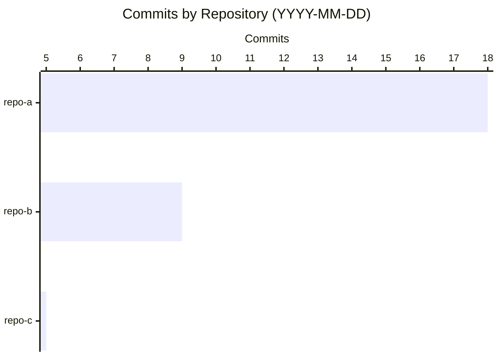

# Daily Organization Report

Generate a comprehensive daily activity report for a GitHub organization. The report covers
all repositories with activity in the specified time window, including commits, pull requests,
branches, issue changes, and force-push tracking.

## Inputs

The following environment variables or prompt context control behavior:

| Variable               | Default                  | Description                                                            |
| ---------------------- | ------------------------ | ---------------------------------------------------------------------- |
| `REPORT_TIME_SCOPE`    | `1 day`                  | Free-form time scope, e.g. "1 day", "3 days", "1 week"                 |
| `REPORT_SUBJECT_SCOPE` | `nsheaps`                | Free-form subject scope, e.g. org name, specific repo, or email filter |
| `REPORT_DATE`          | Yesterday (Eastern Time) | The date the report covers, format YYYY-MM-DD                          |

## Data Gathering

Use `gh` CLI with the available `GH_TOKEN` for all GitHub API calls. The token must have
org-level read access to repositories, issues, and pull requests.

### Step 1: Identify Active Repositories

```bash
# List all repos in the org
gh repo list "${ORG}" --limit 500 --json nameWithOwner,pushedAt -q '.[] | select(.pushedAt >= "'${SINCE_DATE}'") | .nameWithOwner'
```

If the subject scope names a specific repository, only report on that repo.
If the subject scope includes an email filter, gather from all repos but filter commits by that author email.

### Step 2: Gather Commits Per Repository

For each active repository, gather commits across ALL branches:

```bash
# All commits in the time window across all branches
gh api "repos/${OWNER}/${REPO}/commits" \
  --paginate \
  -q '.[] | {sha: .sha, message: .commit.message, author: .commit.author.name, email: .commit.author.email, date: .commit.author.date, branch: "N/A"}' \
  -f since="${SINCE_ISO}" -f until="${UNTIL_ISO}"
```

For more granular per-branch data, also list branches and check commits per branch:

```bash
# List all branches
gh api "repos/${OWNER}/${REPO}/branches" --paginate -q '.[].name'

# Commits on a specific branch
gh api "repos/${OWNER}/${REPO}/commits?sha=${BRANCH}&since=${SINCE_ISO}&until=${UNTIL_ISO}" --paginate
```

### Step 3: Detect Force Pushes and Trace Previous Commit Trees

Force pushes rewrite history. To detect them, check the audit log and reflog events:

```bash
# Check for push events that were force pushes (org audit log)
gh api "/orgs/${ORG}/audit-log" \
  -f phrase="action:git.push created:>=${SINCE_DATE}" \
  -f include=git \
  --paginate \
  -q '.[] | select(.force_push == true) | {repo: .repo, actor: .actor, before: .before, after: .after, timestamp: .created_at}'
```

If the audit log is not available (requires GitHub Enterprise or org admin), use the events API as a fallback:

```bash
# Push events for a repo (includes force push info)
gh api "repos/${OWNER}/${REPO}/events" \
  --paginate \
  -q '.[] | select(.type == "PushEvent") | {ref: .payload.ref, size: .payload.size, before: .payload.before, head: .payload.head, forced: .payload.forced, actor: .actor.login, created_at: .created_at}'
```

When a force push is detected:

1. Record the `before` SHA (the previous HEAD)
2. Record the `after` SHA (the new HEAD)
3. Use `gh api repos/${OWNER}/${REPO}/compare/${BEFORE}...${AFTER}` to show what changed
4. Try to list the commits that were on the old tree: `gh api repos/${OWNER}/${REPO}/commits?sha=${BEFORE}` (these may be garbage-collected)
5. Include both the old and new commit trees in the report under a "Force Push History" subsection

### Step 4: Gather Pull Requests

```bash
# PRs updated in the time window (all states)
gh pr list -R "${OWNER}/${REPO}" \
  --state all \
  --json number,title,state,author,createdAt,updatedAt,mergedAt,url,headRefName,baseRefName,additions,deletions \
  -L 500
```

Filter results to PRs with `updatedAt` within the time window.

### Step 5: Gather Branch Activity

```bash
# All branches with their last commit info
gh api "repos/${OWNER}/${REPO}/branches" --paginate \
  -q '.[] | {name: .name, sha: .commit.sha, protected: .protected}'

# Recently created or deleted branches (from events)
gh api "repos/${OWNER}/${REPO}/events" \
  --paginate \
  -q '.[] | select(.type == "CreateEvent" or .type == "DeleteEvent") | select(.created_at >= "'${SINCE_ISO}'") | {type: .type, ref: .payload.ref, ref_type: .payload.ref_type, actor: .actor.login}'
```

### Step 6: Gather Issue Changes

```bash
# Issues updated in the time window
gh issue list -R "${OWNER}/${REPO}" \
  --state all \
  --json number,title,state,stateReason,author,createdAt,updatedAt,url,labels \
  -L 500
```

Filter to issues with `updatedAt` within the time window. Also track:

- Newly opened issues
- Closed issues (with state reason: completed vs not_planned)
- Label changes
- Assignee changes

For issue timeline events:

```bash
gh api "repos/${OWNER}/${REPO}/issues/${ISSUE_NUMBER}/timeline" --paginate \
  -q '.[] | select(.created_at >= "'${SINCE_ISO}'")'
```

### Step 7: Gather CI Workflow Failures (for Attention Required section)

```bash
# Recent workflow runs with failures
gh api "repos/${OWNER}/${REPO}/actions/runs" \
  -f created=">=${SINCE_DATE}" \
  -f status="failure" \
  --paginate \
  -q '.workflow_runs[] | {name: .name, branch: .head_branch, conclusion: .conclusion, url: .html_url, created_at: .created_at, run_number: .run_number}'
```

Look for patterns of repeated failures on the same branch/PR, which may indicate agent
struggles. Cross-reference with PR and commit data from earlier steps.

## Report Format

The output must be valid GitHub-flavored Markdown suitable for posting as a GitHub issue body.

### Title

```
YYYY-MM-DD Daily Report
```

Where YYYY-MM-DD is the report date (the day being reported on).

### Structure

The report is a single Markdown document. The template below shows the required structure.
Sections marked with `{placeholders}` should be filled with actual data.

#### Header

    # YYYY-MM-DD Daily Report

    > **Scope**: {subject_scope} | **Period**: {time_scope} | **Generated**: {timestamp} ET

#### Attention Required

This section appears **immediately after the header**, before any other content. It draws
the reader's attention to items that need human intervention or investigation.

Analyze the gathered data to identify two categories of items:

**1. Agent Failures & Issues** — Detect patterns that suggest automated agents struggled
or failed during the reporting period:

- PRs with many force pushes on the same branch in a short time (suggesting repeated
  failed attempts)
- Commits with struggle-indicator messages ("retry", "attempt", "revert", "try again",
  "wip", "broken") appearing in rapid succession on the same branch. Exclude conventional
  commit `fix:` or `fix(scope):` prefixes — those indicate intentional bug fixes, not
  agent struggles. Only flag "fix" when 3+ fix-like commits appear within 1 hour on the
  same branch (suggesting iterative failed attempts rather than normal development)
- PRs that were opened and closed without merging multiple times
- CI workflow runs that failed repeatedly on the same PR/branch
- Branches with an unusually high number of commits relative to the diff size (churn)
- Any commit messages explicitly mentioning errors, failures, or workarounds

**2. Action Items Requiring Human Involvement** — Identify items from commits, PRs, and
issues that explicitly call out the need for human action:

- References to secrets that need to be created or rotated
- Comments or PR descriptions mentioning "needs review", "need approval", or similar
- Issues labeled with `status:blocked` or `status:needs-review`
- References to permissions, access tokens, or credentials that need setup
- Deployment or infrastructure changes that require manual steps
- Any TODO/FIXME comments added in the reporting period that reference manual action

Format this section as a blockquote callout with warning emojis:

    > ⚠️🚨 **ATTENTION REQUIRED** 🚨⚠️
    >
    > ### 🔴 Agent Failures & Repeated Iterations
    >
    > {List each detected issue with repo, branch/PR link, and brief description}
    > {If none detected: "No agent failure patterns detected."}
    >
    > ### 🟡 Items Needing Your Involvement
    >
    > {List each item with repo, issue/PR/commit link, and what action is needed}
    > {If none detected: "No items requiring manual intervention."}

#### Top Repos by Commits

A horizontal bar chart showing the total number of commits per repository during the
reporting period. This gives a quick visual overview of where the most activity occurred.

- Use a mermaid `xychart-beta` chart with **horizontal** layout
- X-axis: repository short names (without the org prefix), sorted by commit count descending
- Y-axis: total commit count
- One bar per repository
- Use all commits gathered in Step 2 (across all branches)
- Only include repos that had at least 1 commit

**Design note**: This chart intentionally replaces the previous time-of-day stacked bar
chart. The temporal dimension (when activity occurred) is traded for a clearer at-a-glance
view of where activity concentrated. Time-of-day patterns can still be inferred from the
commit tables in the Repository Activity section below.

Example chart (actual values will differ):


```mermaid
xychart-beta horizontal
    title "Commits by Repository (YYYY-MM-DD)"
    x-axis ["repo-a", "repo-b", "repo-c"]
    y-axis "Commits"
    bar [18, 9, 5]
```

#### Remaining Report Sections

After the attention callout and chart, include these sections in order:

    ## Executive Summary

One paragraph summarizing the day's activity across the org: total commits, PRs opened/merged/closed,
issues opened/closed, repos with activity, notable force pushes.

    ## Repository Activity

    ### {owner}/{repo-name}

For each active repo (sorted alphabetically), include:

- **Commits ({count})** — table with SHA (linked), Author, Branch, Message, Time (ET)
- **Pull Requests ({count})** — table with #, Title, State, Author, Branch, +/-, Updated
- **Branch Activity** — table with Branch, Event, Actor, Time
- **Issue Changes ({count})** — table with #, Title, Change, State, Labels
- **Force Push History** — only if force pushes detected; table with Branch, Actor, Time,
  Before/After SHAs (linked), Commits Lost/Added. Use `<details>` for old commit tree.

Separate each repo with `---`.

    ## Cross-Repo Summary

- **By Author** — table with Author, Commits, PRs, Issues
- **Activity Timeline** — chronological list of significant events across all repos (ET)

  ## Methodology Notes

- Time window: {SINCE_ISO} to {UNTIL_ISO}
- Repositories scanned: {count}
- Repositories with activity: {count}
- Force push detection: {method used - audit log or events API}
- Any data gaps or API limitations encountered

## Formatting Rules

1. **All references must be clickable links**: Every SHA, issue number, PR number, and branch name
   that can link to GitHub must be a markdown link
2. **Times in Eastern Time**: Convert all UTC timestamps to US Eastern Time for display
3. **Use collapsible sections** (`<details>`) for verbose data like force-push old commit trees
4. **Sort repos alphabetically** within the report
5. **Sort commits chronologically** (oldest first) within each repo section
6. **Include zero-activity note**: If a repo had no activity, do not include it
7. **Differentiate issue close reasons**: Show "closed (completed)" vs "closed (not_planned)"

## Error Handling

- If the org audit log is inaccessible, note this in Methodology and fall back to events API
- If a repo returns 404 (private/deleted), skip it and note in Methodology
- If rate limiting occurs, note partial data in Methodology
- If commits are garbage-collected after force push, note "commits no longer available"

## Output

The final report content should be posted as a GitHub issue in the triggering repository with:

- Title: `YYYY-MM-DD Daily Report`
- Label: `daily-report`
- The full markdown report as the issue body
